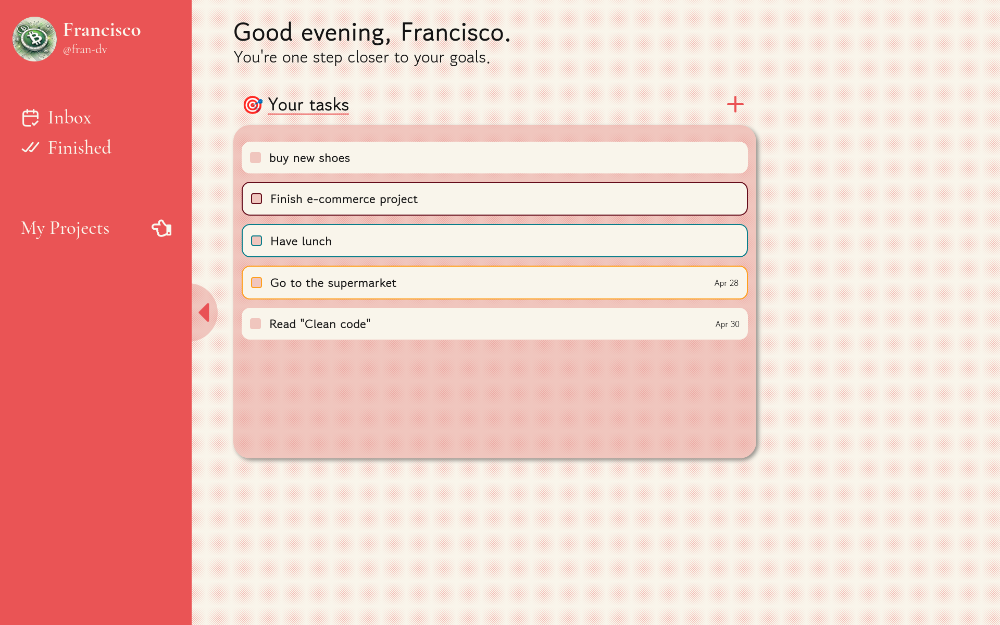

# 📋 To-Do List App

A clean and intuitive to-do list application designed to help you manage tasks and projects efficiently.
 
This project was developed as part of the [The Odin Project](https://www.theodinproject.com/) full-stack web development curriculum.

✨ Try it out now with the [Live Demo](https://fran-dv.github.io/to-do-list/)

---

## ✅ Features
- **Task Management**: Create, edit, and remove tasks seamlessly.
- **Subtasks**: Divide tasks into smaller actionable items.
- **Prioritization**: Assign Low, Medium, or High priority levels.
- **Due Dates**: Set deadlines and stay on track.
- **Project Organization**: Group tasks under distinct projects.
- **User Profile**: Personalize your workspace with a name, username, and photo.
- **Persistent Storage**: Automatic saving of data via browser Local Storage.

---

## 📖 What I Learned
- **Local Storage**: Implemented save/load of nested data (projects, tasks, subtasks) in Local Storage.
- **Data Persistence**: Designed robust strategies for serializing and deserializing complex application state.
- **Image Handling**: Added support for user profile photo upload and display.
- **Date Management**: Leveraged `date-fns` for parsing, formatting, and validating due dates reliably.

…and much more along the way.

---

## 🛠️ Technologies Used
- **HTML5** & **CSS3**
- **JavaScript (ES6+)**
- **[date-fns](https://date-fns.org/)** for date manipulation
- **Webpack** for module bundling and local development

---

> **Desktop Only**  
> This version is not fully responsive and is intended for desktop use.